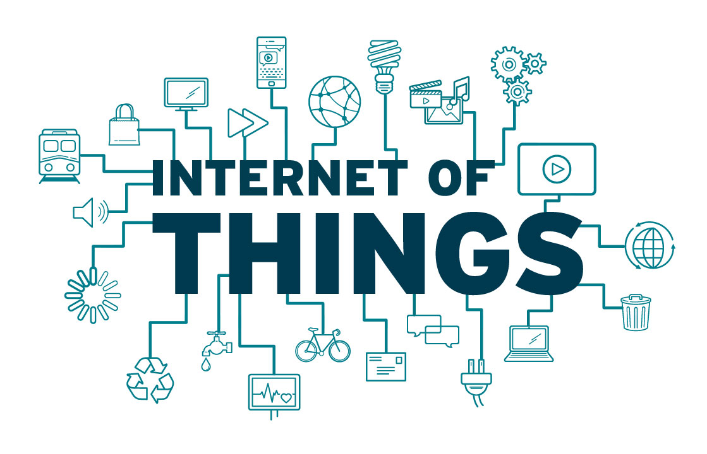

# II-Ambient-Intelligence
Course at the university of Antwerp for a Masters Degree in Industial Engineering: Electronics-ICT.

This git will be a storage for the final portfolio of the course.
The different parts in this git:

1) Documentation:
A small overview on all the used technologies, implementations and source code. This is so everybody knows what everybody has been doing over the past weeks. Don't go in to much detail but enough to know what it's about and how it's implemented.

2) Source Code:
All the final code running on both the STM-boards as on the Taspberry Pi 3

3) Powerpoints:
Not yet sure if we want to share these
